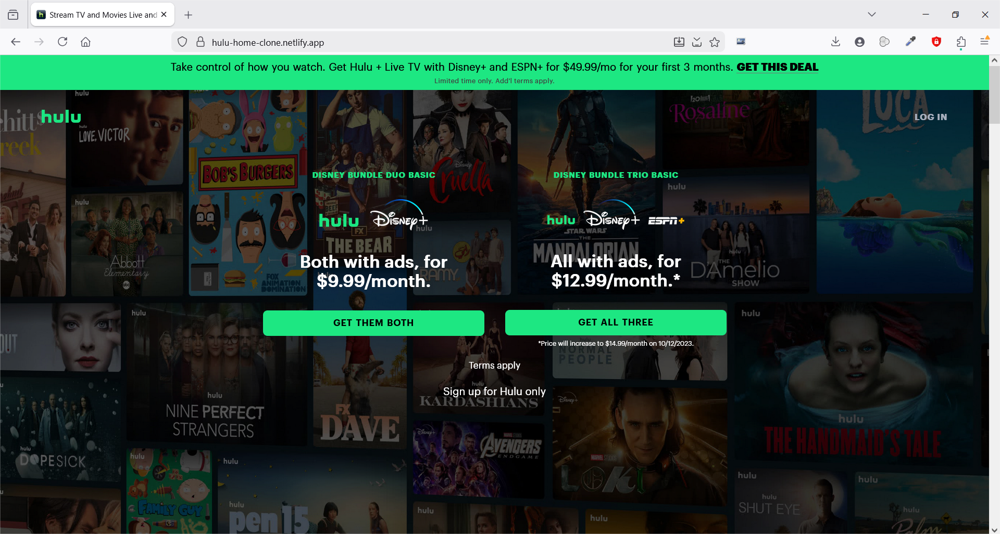
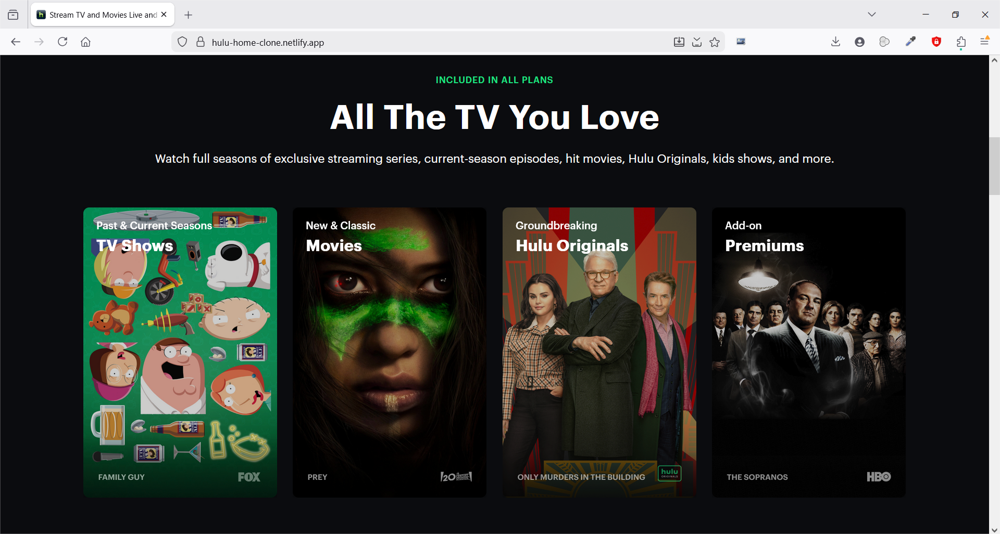
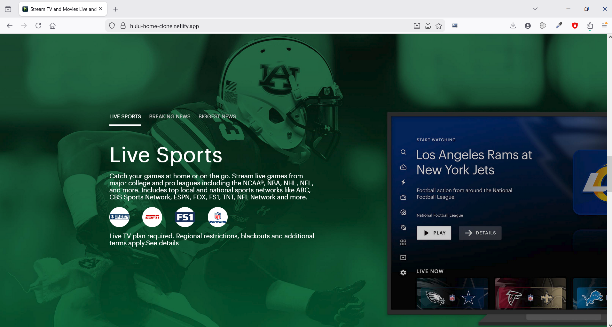
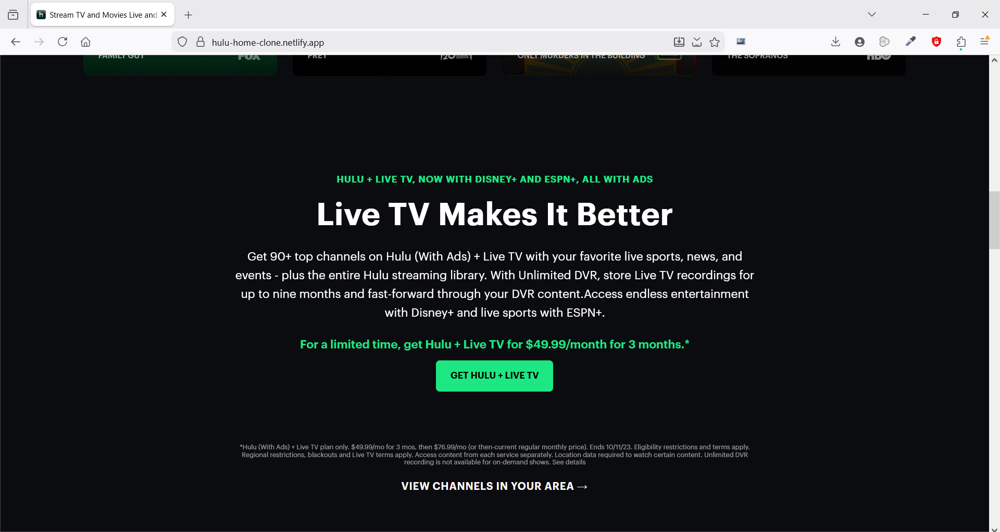
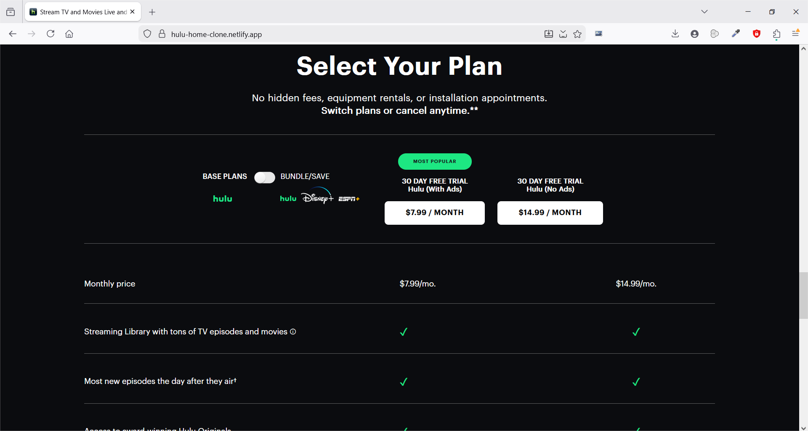
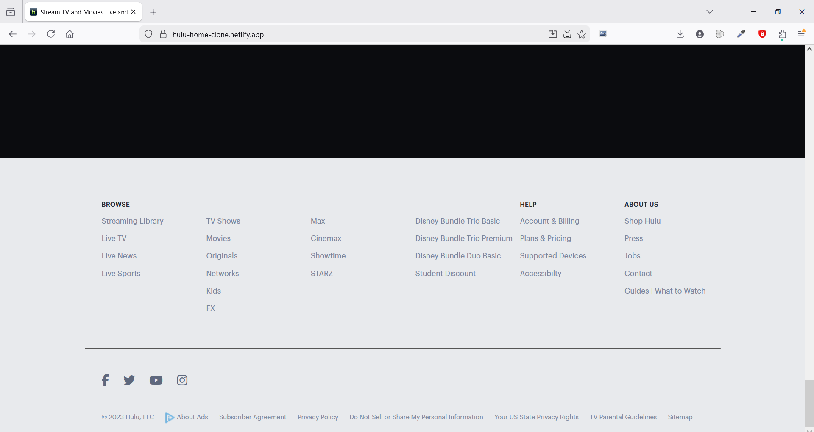

# 📺 Hulu Home Clone

A pixel-faithful, fully responsive clone of the Hulu landing page built using  **vanilla HTML, CSS, and JavaScript** .
This project focuses on  **layout precision, animation timing, responsiveness, and clean separation of concerns** —replicating the real Hulu homepage behavior as closely as possible.

---

## ✨ Highlights

* 📱 **Fully responsive** across desktop, tablet, and mobile
* 🎞️ **Smooth, staggered animations** inspired by Hulu’s original UI
* 👁️ **Intersection Observer–based reveal effects** (no animation libraries)
* 🧩 **Section-wise CSS architecture** for clarity and scalability
* ⚡ **Zero frameworks** — pure HTML, CSS, and JavaScript

---

## 🔗 Live Demo

👉 [robogeniz.netlify.app](https://robogeniz.netlify.app)

---

## 📸 Screenshots & UI Walkthrough

A visual walkthrough of the Hulu homepage clone, highlighting layout accuracy, responsiveness, and interaction flow.

### 🎬 Navigation & Hero Section

* Faithful recreation of Hulu’s hero layout with strong visual hierarchy
* Fully responsive header and CTA-focused introduction



..................................................................................................

### 🧩 Content Cards Section

* Created modular content cards and added staggered reveal animations using vanilla JavaScript



..................................................................................................


### 🏟️ Live Sports Section

* Brand-consistent section with scroll-triggered reveal animations with responsive layout



..................................................................................................


### 📖 About Section

* Clean informational layout with balanced spacing and typography
* Subtle animation for guided user attention



..................................................................................................


### 💳 Plans & Pricing

* Structured pricing layout for easy comparison
* Responsive design maintaining alignment and readability




..................................................................................................


### 📜Footer & Page Closure

* Multi-column footer with clear link hierarchy
* Consistent branding and visual closure



---

## 🧠 What This Project Demonstrates

This project emphasizes  **frontend fundamentals over frameworks** :

* Strong grasp of **CSS layout systems** (Flexbox, positioning, responsive units)
* Animation orchestration using **CSS transitions + JS timing**
* Efficient scroll-based animations using **Intersection Observer**
* Maintainable styling via **modular CSS files per section**
* Attention to **visual accuracy and UX polish**

---

## 🗂️ Project Structure

```txt
├── index.html
├── css/
│   ├── base.css
│   ├── header.css
│   ├── banner.css
│   ├── hero.css
│   ├── contentCards.css
│   ├── about.css
│   ├── liveSports.css
│   ├── plans.css
│   └── footer.css
├── js/
│   └── main.js
└── Images/
```

Each major section of the UI has its  **own dedicated CSS file** , improving readability and long-term maintainability.

---

## ⚙️ JavaScript Behavior

* **Staggered card animations** on page load
* **Scroll-triggered reveals** using `IntersectionObserver`
* Clean, minimal JS focused purely on UI behavior

No jQuery, no animation libraries — just modern browser APIs.

---

## 🚀 Tech Stack

* **HTML5**
* **CSS3**
* **Vanilla JavaScript**
* **Font Awesome** (icons)

---
